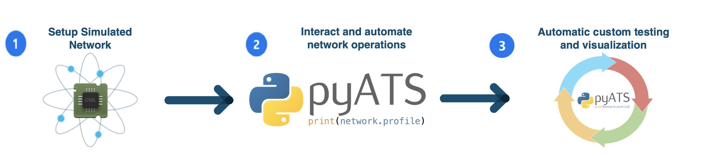
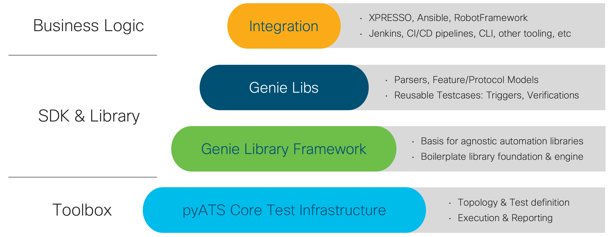
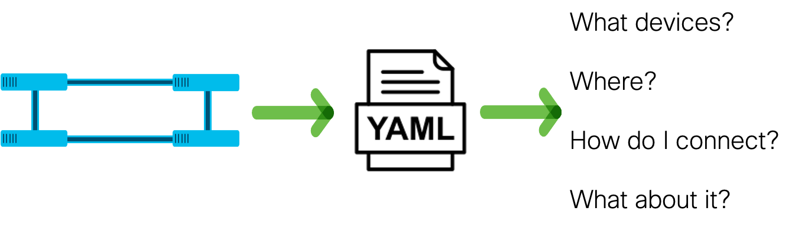

# GVE_DevNet_SimulatedTestEnvironment

This repository serves as proof of concept on how to setup and develop a simulated test environment in order to move towards a NetDevops way of doing network engineering. In this case the project serves as use case for network engineers that would like to gain more insight into the visibility of the network, increase the efficiency of their network tests and compare the state of the network over periods of time, as well as implementing a fall-back mechanism, allowing to revert the changes in case of an error or bug, between other features.

This project aims to show how network engineers can simulate their test environment in Cisco Modeling Labs (CML), where they can easily collaborate with multiple users. Moreover, the users can easily spin up labs that are independent of each other. In addition, we show how to perform automated testing through pyATS, where can obtain standardized test reports, which is beneficial in order to monitor the health of the network. Last, we show how to compare network states through Genie, where we can learn the network state and we can parse the outputs of various commands. Overall, we provide a solution that gives more insights to network engineers and that will help them in testing their network.

## Contacts
* Alvaro Escribano alvescri@cisco.com
* Simon Fang sifang@cisco.com
* Margot Schipper marschip@cisco.com

## Solution Components
* CML
* PyATS
* Genie

# Installation/Configuration

## Installing CML
There are two option for CML: we can install it either as a VM or on a bare metal server.

### Virtual Machine Installation
Download controller OVA and reference platform ISO file. The controller OVA file is the CML server VM.
ISO file contains VM images for the different node types to be run in CML.
Deployment of the OVA file and further steps can be found [here](https://developer.cisco.com/docs/modeling-labs/#!cml-2-1-admin-guide-installing-cml-deploying-the-ova-file-on-vmware-workstation-fusion).

### Bare Metal Installation 
Download controller ISO  and reference platform ISO file. Controller ISO file is bootable DVD image.
CML bare metal deployments are only supported on specific UCS hardware. These are the [system requirements](https://developer.cisco.com/docs/modeling-labs/#!cml-2-1-admin-guide-installing-cml-preparing-for-installation) and [installation guide](https://developer.cisco.com/docs/modeling-labs/#!cml-2-1-admin-guide-installing-cml-bare-metal-installation) for the bare metal deployment.
Some of the requirements are:
* Memory >8 GB
* CPU   4 physical cores
* Hard Disk >16GB
* VMware ESXi 6.5 or later 

## Installing PyATS
Installation of the core framework, Genie and standard network automation library is done via `pip install pyats[full]`. In case you are installing on an Apple device, then it is done via `pip install "pyats[full]"`.
If using Python v3.x, use `pip3 install` instead.

        $ pip install pyats[full]

Please note: pyATS require python 3.6, 3.7, or 3.8

# Getting Started
Using the following set of commands, you can clone the repository your local machine. Then, we change our
directory to this repository and we create a virtual environment, where we install 
all the dependencies. 

    $ git clone [repository url]
    $ cd GVE_DevNet_SimulatedTestEnvironment 
    $ python -m venv venv
    $ source venv/bin/activate
    $ pip install -r requirements.txt
    
## Overview of Repository

This project can be approximately divided into three steps.

1. First, we have an 
automated set-up of a lab in CML through a Python script. You can find the script
`create_cml.py` alongside the instructions in the subdirectory [CML](CML). 

2. After having successfully set-up a lab in CML, we can send commands to the devices and obtain the outputs. Also, we can parse the output and show the differences between the output. For running commands, please go to the [Commands](Commands) subdirectory. 

3. We can take it a step further by automate the tests and obtain standardized reports. We use the aetest module for these standardized tests. For these automated tests, please go to the [Tests](Tests) subdirectory. In these subdirectories, 
you will find additional instructions on how to run the scripts.

# Components
## CML
Cisco Modeling Labs is a network simulation tool which helps to simulate Cisco and non-Cisco networks. It allows you to simulate your test network. It is a multiuser, on-premise, shared-lab solution that allows your whole team to collaborate. For further information, please go to the follow [link](https://www.cisco.com/c/en/us/products/cloud-systems-management/modeling-labs/index.html).

## PyATS
PyATS is an end-to-end automated testing ecosystem. It integrates with many other SDKs to customize the functionalities and features. It is a highly pluggable Python framework, designed for Agile and rapid development iterations. Genie is developed side-by-side with PyATS and focuses on network device automation and validation.

### Testbed
Devices under testing are described in YAML format in testbed files. A testbed file provides the connectivity methods and credentials in order for your machine to connect with the devices that you would like to test. Please click [here](https://pubhub.devnetcloud.com/media/pyats/docs/topology/example.html) for an example. 

### LICENSE

Provided under Cisco Sample Code License, for details see [LICENSE](LICENSE.md)

### CODE_OF_CONDUCT

Our code of conduct is available [here](CODE_OF_CONDUCT.md)

### CONTRIBUTING

See our contributing guidelines [here](CONTRIBUTING.md)

#### DISCLAIMER:
<b>Please note:</b> This script is meant for demo purposes only. All tools/ scripts in this repo are released for use "AS IS" without any warranties of any kind, including, but not limited to their installation, use, or performance. Any use of these scripts and tools is at your own risk. There is no guarantee that they have been through thorough testing in a comparable environment and we are not responsible for any damage or data loss incurred with their use.
You are responsible for reviewing and testing any scripts you run thoroughly before use in any non-testing environment.